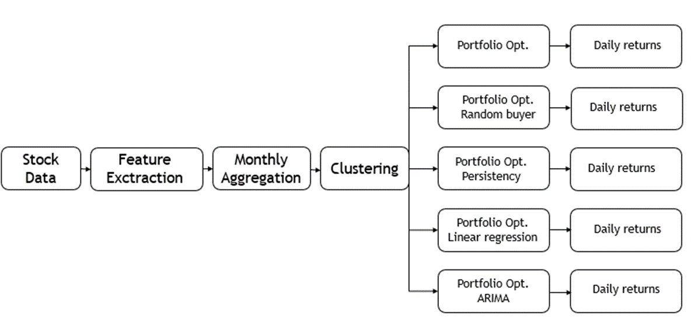

# Portfolio Optimization via Machine Learning Models

This repository contains code and documentation for a university project focused on portfolio optimization using machine learning models in the Italian and American stock markets.

## Overview

The project aims to address challenges in quantitative finance by selecting an optimal stock portfolio and improving returns annually. We leverage various clustering techniques to identify promising shares and optimize portfolio weights based on the Sharpe ratio. Additionally, we explore regression and ARIMA models to guide investment decisions.

## Key Features

- Implementation of clustering techniques (DBSCAN, K-means) for stock selection.
- Portfolio optimization based on the Sharpe ratio
- Regression and ARIMA models for trend prediction and decision-making.
- Evaluation and comparison of results in the Italian and American markets.

## Folder Structure

- `Dataset`: Contains the utility functions and the metrics used to build our costum dataset
- `Optimization`: Contains the clustering techniques used and the portoflio optimization done over the sharpe ratio.
- `Evaluation`: Contains the evaluation metrics and the plots.
- `Report`: Project paper. 
- `Italian_market`: Notebooks specific to the Italian market.
- `American_market`: Notebooks specific to the American market.
- `Images`: Images used in documentation and visualizations.

## Results

- Detailed results and analysis can be found in the project report (`Report/report.pdf`).
- Visualizations and performance metrics are available in Jupyter notebooks (`American_market`,`Italian_market`).

## Contributors

- [Francesco Pivi](https://github.com/your-username)
- [Elisa Castanari](https://github.com/teammate1)
- [Matteo Fusconi](https://github.com/teammate2)

## License

This project is licensed under the MIT License - see the [LICENSE](LICENSE) file for details.

## Acknowledgments

- Special thanks to Luca Giuliani for guidance and support throughout the project.
- Thanks to University of Bologna for providing resources and facilities for conducting research.

